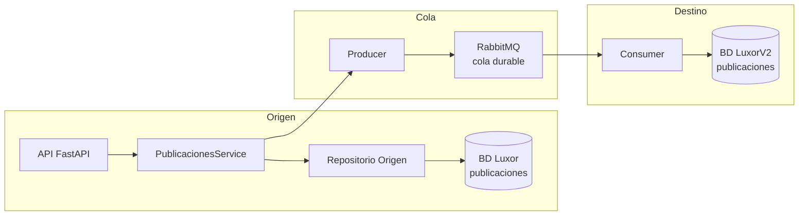
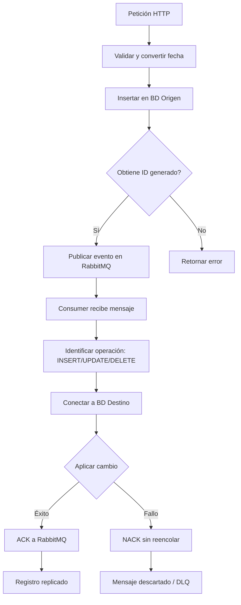

# Integrador con CDC, RabbitMQ, API y consumidor
## **🧪 ¿Cómo probar?**

1. Crea las tablas en Luxor (origen) y LuxorV2 (destino):

sql

```
CREATE TABLE publicaciones (
    id INT IDENTITY(1,1) PRIMARY KEY,
    titulo NVARCHAR(255),
    fecha DATETIME,
    is_active BIT
);
-- (misma estructura en LuxorV2)
```

1. Instala dependencias: `pip install fastapi uvicorn pika pyodbc python-dotenv`
2. Levanta RabbitMQ: `docker-compose up -d`
3. Ejecuta el consumidor: `python scripts/start_consumer.py`
4. Ejecuta la API: `python api/api_server.py`
5. POST a `http://localhost:8000/publicaciones/` con JSON:

json

```
{
    "titulo": "Oferta especial",
    "fecha": "2025-04-11 21:10:50",
    "is_active": true
}
```

Verás cómo se inserta en origen, se envía el mensaje y el consumidor replica en destino.

### Corre en paralelo en diversas consolas:

```markdown
 $ docker-compose up -d
 $ (venv)python3 scripts/start_consumer.py
 $ (venv)python3 api/api_server.py

```

## **🧹 9. Detener servicios**

- **API**: Ctrl+C en su terminal.
- **Consumer**: Ctrl+C en su terminal.
- **RabbitMQ**: `docker-compose down`

---

## **✅ Ventajas de esta arquitectura simple**

- **Reutiliza** tu `MSSQLConnector` y patrón de repositorio.
- **Desacopla** con cola RabbitMQ (persistente).
- **Escalable** – puedes añadir otro consumidor para noticias.
- **Extensible** – fácil agregar procesadores (NER, tono) antes de escribir en destino.
- **Con API** – permite probar el flujo manual o desde otros sistemas.

## **✅ Notas importantes**

- Asegúrate de que `config.py` tenga definidas las variables `RABBITMQ_HOST`, `RABBITMQ_QUEUE`, `LUXORV2_SERVER`, etc. Si no las has añadido, edítalo o créalas en `.env`.
- Si LuxorV2 es la misma base de datos que Luxor, usa los mismos valores de `CONNECTION_DB` para evitar crear otra conexión.
- El consumidor reintenta automáticamente si falla la conexión a destino (gracias a `basic_nack(requeue=True)`).
- Puedes monitorear las colas en la UI de RabbitMQ.

**2. Diagrama de componentes (arquitectura general)**



**Diagrama de flujo de datos (nivel lógico)**


